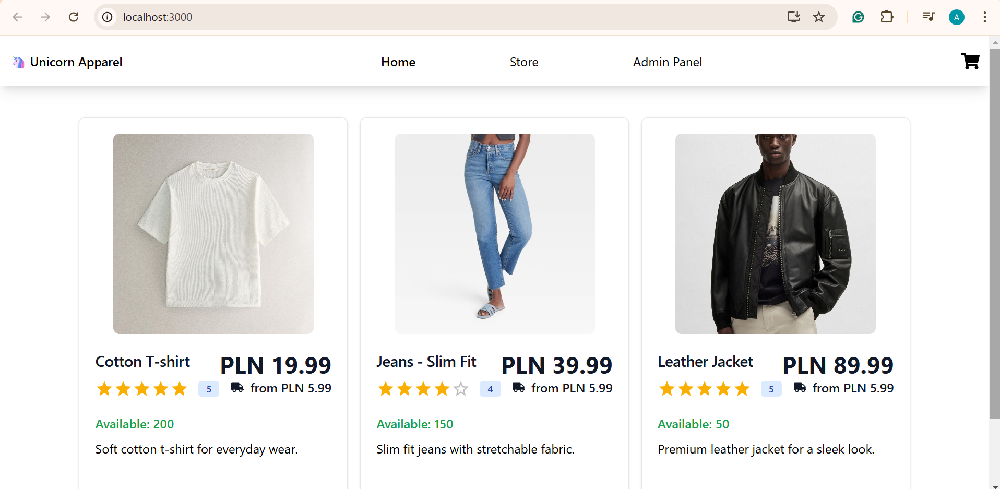
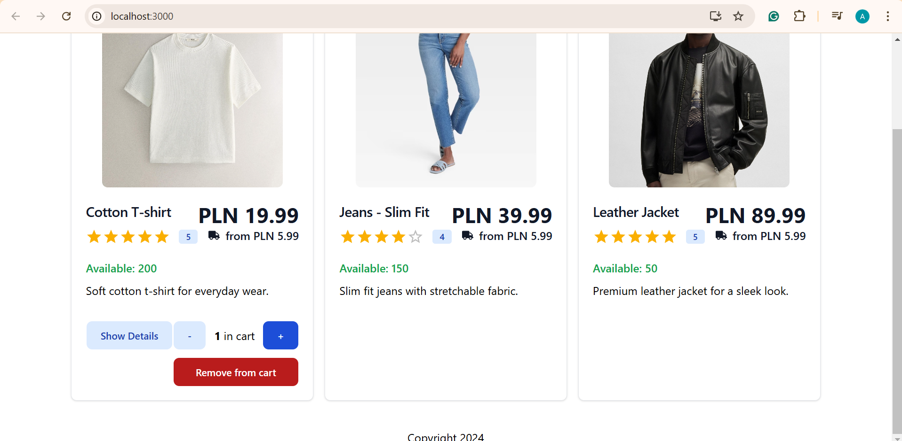
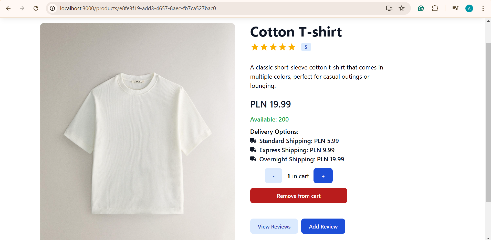
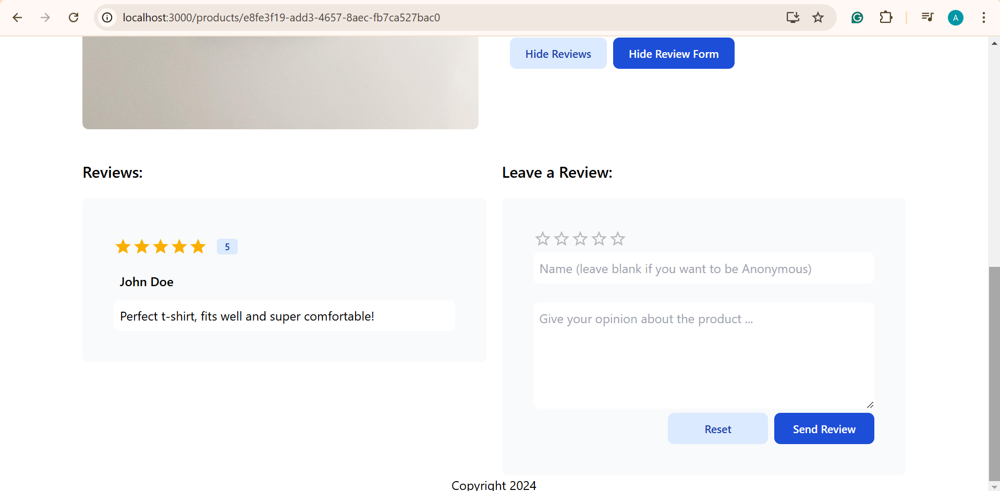
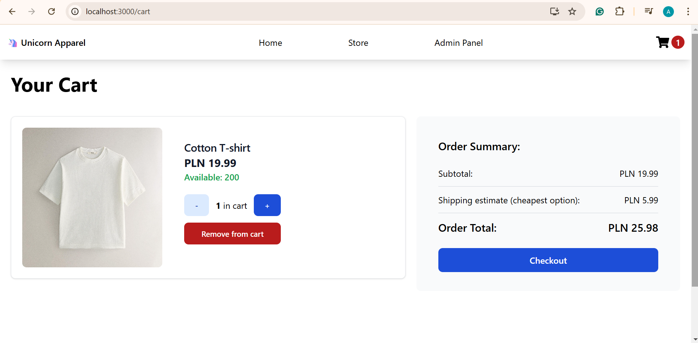
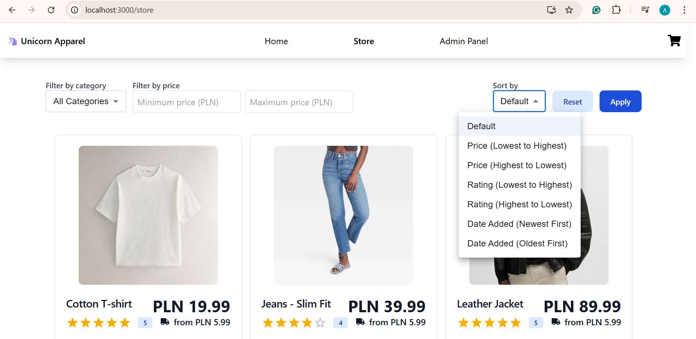
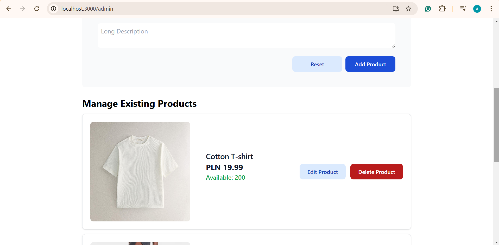
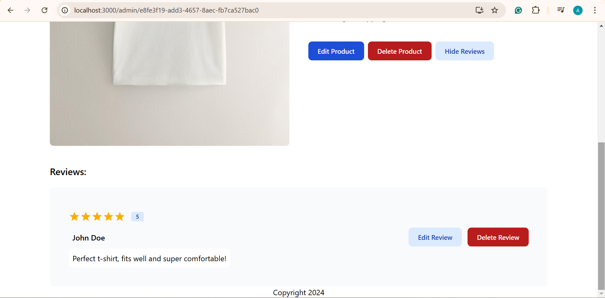

# 🦄 Unicorn Apparel

Welcome to **Unicorn Apparel**, your go-to e-commerce app for all things stylish and magical! Browse, sort, and filter products, read or leave reviews, place orders and perform admin CRUD operations on the shop's items all powered by React, Express, and Neo4j.

---

## ✨ Features

- **Browse Products:** View our entire collection with advanced sorting and filtering options.
- **Reviews:** Share your thoughts and read what others think.
- **Orders:** Place your orders effortlessly.
- **Admin CRUD:** Manage store products and reviews with ease.

---

## 🚀 Tech Stack

- **Frontend:** React
- **Backend:** Express.js
- **Database:** Neo4j

---

## 🚀 App preview










---

## 🎯 Installation

1. Clone the repository:
   ```bash
   git clone https://github.com/cloudala/Unicorn-Apparel.git
   cd unicorn-apparel
   ```
2. Set up the Neo4J Docker Container:

   ```bash
   cd server
   ```

   Create a .env file analogous to this one:

   ```bash
   # .env
   PORT=4000
   NEO4J_URI=bolt://localhost:7687/neo4j/somepassword
   NEO4J_USERNAME=neo4j
   NEO4J_PASSWORD=somepassword
   ```

   ```bash
   docker-compose up
   ```

   Go to [http://localhost:7474](http://localhost:7474), log in with your credentials and copy the contents of init.cypher into the browser Neo4J console. The database is ready!

3. Run the Express.js backend:
   ```bash
   cd server
   npm install
   node app.js
   ```
4. Run the React.js frontend:
   ```bash
   cd ../client
   npm install
   npm start
   ```

And that's it! Now you can sit back and enjoy your magical shopping endeavour! 😊
